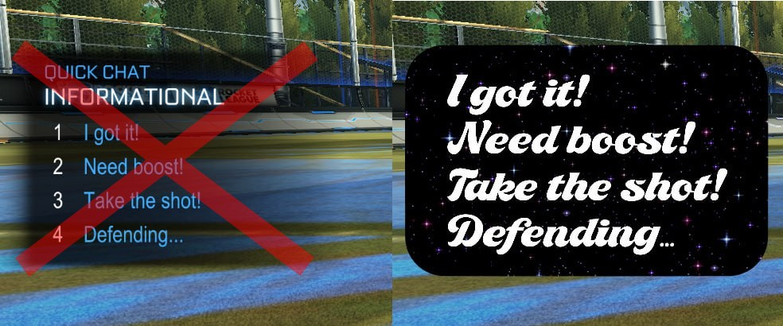
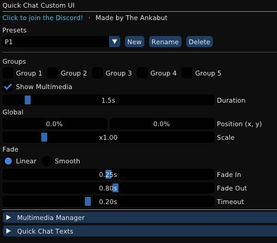

# Quick Chat Custom UI

Replace Rocket League's default Quick Chat wheel with your own customizable overlay.





## Features

* Add images and animated GIFs to your Quick Chat overlay. Position, scale, and adjust them however you want.
* Customize the Quick Chat text displayed on the overlay with your own fonts, colors, and positioning. The actual messages sent remain unchanged.
* Save your setup as presets and share them.
* Enable or disable the custom overlay per QC group. Disabled groups keep using the default wheel.

## Data Folders

Presets are stored in:

```
%appdata%\bakkesmod\bakkesmod\data\QuickChatCustomUI\Presets\
└── MyPreset/
    ├── preset.json
    └── media/
```

To share a preset, copy the preset folder.

## How It Works

Replaces Rocket League's Quick Chat wheel with your custom overlay. Your Quick Chats still send as default, only the visuals change.

## Installation

1. Download the ZIP from [Releases](https://github.com/TheAnkabut/QuickChatCustomUI/releases).
2. Extract it.
3. Place the DLL in: `%appdata%\bakkesmod\bakkesmod\plugins`

*This plugin sends a one-time request with user ID to count unique users.*

## Discord

Questions? Join the Discord.

[](https://discord.gg/FPvkjaBPEA)

## Support

If you found this plugin useful, any support is appreciated.

<a href="https://ko-fi.com/theankabut"></a>
